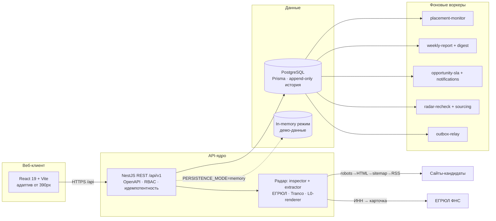

<div align="center">

# 📡 Embed Partner OS

### Система автоматизации развития эмбедной сети RUTUBE

*Радар поиска площадок · ЛПР из открытых данных ФНС · Воронка · SLA-мониторинг · Недельные отчёты*

[](CHANGELOG.md)
[](#-проверка)
[](https://nodejs.org)
[](https://nestjs.com)
[](https://react.dev)
[](#-продакшн-одной-командой)
[](LICENSE)

</div>

---

## Что это

Полноценная операционная система для команды, которая развивает эмбедную сеть RUTUBE:
от поиска потенциальных площадок до подписания партнёрства, контроля здоровья размещений
и недельной отчётности руководителю.

> **Ключевая особенность — «Радар».** Система сама исследует сайты-кандидаты через
> robots.txt → HTML → sitemap → RSS, находит контакты и Telegram-каналы, достаёт
> ФИО и должность руководителя из официальных данных ЕГРЮЛ (ФНС), определяет регион,
> считает объём видеостраниц и трафик — и сводит всё в объяснимый Partner Score
> с готовым текстом первого касания.

## Модули

| Модуль | Что делает |
|---|---|
| 🗞️ **Сегодня** | Приоритетная очередь менеджера: «Критично» / «Сегодня» / «Можно позже» / «Ожидание», объяснимый Priority Score |
| 🔻 **Воронка** | Канбан + таблица из одного ответа API, проверяемые переходы стадий, запрет запуска без здорового размещения |
| 👤 **Контакты** | Реестр с поиском и фильтрами, contact–organization без жёсткой привязки, безопасное слияние дублей с сохранением истории |
| 🏢 **Организации** | Группировка брендов/юрлиц/доменов, единая карточка со связями и аудитом, импорт CSV/XLSX с дедупликацией и отменой |
| 📡 **Радар** | Автоисследование сайтов: контакты, Telegram («канал площадки»/«канал автора»), ЛПР из ЕГРЮЛ (ООО и ИП), регион ФНС, sitemap-видео, Tranco/Similarweb |
| 🖥️ **Размещения** | Реестр Placement, плановая L0-проверка iframe, технические риски, Alert и Task после двух ошибок подряд |
| ⏱️ **SLA** | Версионные пороги, предупреждение при зависании, однократная эскалация руководителю, инциденты в недельном отчёте |
| 📊 **Отчёты** | Версионный `ReportSnapshot` по неделям Europe/Moscow, автозапуск по понедельникам 10:00 MSK, явная полнота данных |
| 🛡️ **Роли и доступ** | 7 ролей, точечные разрешения, optimistic locking, защита от self-lockout, аудит каждой мутации |
| ✍️ **Профиль отправителя** | Подпись под первым касанием кандидату, per-user настройка |

## Архитектура



**Надёжность в основе:** обязательный `Idempotency-Key` на мутациях, transactional outbox,
optimistic locking, append-only `Interaction / AuditLog / StageHistory / ReportSnapshot /
RadarEvidence / RadarScoreSnapshot / RadarDecision` (защищены триггерами от UPDATE/DELETE).

## Быстрый старт

```bash
git clone https://github.com/panfiloveshow/embed-partner-os.git
cd embed-partner-os
npm install
npm run dev
```

| Что | Где |
|---|---|
| 🌐 Веб-интерфейс | `http://localhost:5173` |
| 🔌 API | `http://localhost:3000/api/v1` |
| 📚 OpenAPI UI | `http://localhost:3000/api/docs` |

По умолчанию используется in-memory режим с демонстрационными данными.
Для PostgreSQL-режима: `docker compose up -d postgres`, затем `cp .env.example .env`
и серия `npm run db:*` — см. раздел [PostgreSQL-режим](#postgresql-режим).

## Продакшн одной командой

```bash
cp .env.example .env
docker compose -f compose.prod.yaml up -d --build
```

PostgreSQL + автоматические миграции + API + веб за nginx с прокси `/api` + все воркеры.
Health-check без аутентификации: `GET /api/v1/health`.

<details>
<summary><b>Режимы аутентификации</b></summary>

| Режим | Описание |
|---|---|
| `AUTH_MODE_LOCAL_PASSWORD` | Встроенный вход по паролю: scrypt, HS256-сессии 12ч, rate-limit, форма входа в вебе |
| `trusted_proxy` | Корпоративный контур с доверенным identity-заголовком |
| `oidc_jwt` | Проверка Bearer JWT: HTTPS JWKS, issuer, audience, асимметричные алгоритмы |

Уведомления SLA/дайджеста: webhook или Telegram (`*_CHANNEL=telegram`).
</details>

## PostgreSQL-режим

```bash
docker compose up -d postgres
cp .env.example .env
npm run db:validate && npm run db:generate && npm run db:migrate && npm run db:seed
PERSISTENCE_MODE=postgres npm run dev
```

Миграции только добавляют объекты — существующие данные не трогаются.
Резервация idempotency, завершение задачи, создание Interaction и следующей задачи,
обновление Opportunity, аудит и OutboxEvent выполняются **в одной транзакции**.

<details>
<summary><b>Пример идемпотентной мутации</b></summary>

```bash
curl -X POST http://127.0.0.1:3000/api/v1/tasks/task-1/complete \
  -H 'Content-Type: application/json' \
  -H 'Idempotency-Key: 9c929f66-a16f-4c65-95e4-ccbd84cb67c8' \
  -d '{"contactId":"00000000-0000-4000-8000-000000005000","interactionType":"email","outcome":"Получен ответ","summary":"Партнёр подтвердил следующий шаг","next":{"mode":"task","title":"Отправить примеры","dueAt":"2026-08-18T09:00:00.000Z"}}'
```

Повтор того же ключа с тем же payload не создаёт дублей; ключ с другим payload — `409 IDEMPOTENCY_KEY_REUSED`.
</details>

## 🧪 Проверка

```bash
npm test          # 335+ тестов: 214 API · 69 веб · 53 домен
npm run typecheck # строгий TS по всему монорепо
npm run build     # сборка пакетов, API и веба
npm run lint      # ESLint
```

Vitest повсюду; сетевые стабы через инжектируемый `Fetcher` — ни одного реального
запроса из юнит-тестов. Доменные бизнес-правила покрыты отдельным пакетом `@embed-os/domain`.

## Структура монорепозитория

```text
apps/
  api/         NestJS API: модули auth, monitoring (Радар), workers, persistence
  web/         React + TypeScript + Vite
packages/
  contracts/   общие API-типы (единый источник правды)
  domain/      чистые бизнес-правила, скоринг и их тесты
deploy/        nginx.conf для прод-контура
docs/
  adr/         архитектурные решения
  runbooks/    эксплуатационные сценарии каждого модуля
  design/      визуальная спецификация экранов
scripts/       backup / restore / dev-postgres
```

## 📖 Документация

| Runbook | Тема |
|---|---|
| [`deploy.md`](docs/runbooks/deploy.md) | Прод-развёртывание, бэкап/восстановление, диагностика |
| [`radar.md`](docs/runbooks/radar.md) | Загрузка кандидатов, исследование, оценка, решения |
| [`opportunity-stage-transitions.md`](docs/runbooks/opportunity-stage-transitions.md) | Стадии воронки, пауза, закрытие, BR-007 |
| [`contact-registry.md`](docs/runbooks/contact-registry.md) | Жизненный цикл и слияние контактов |
| [`organization-import.md`](docs/runbooks/organization-import.md) | Импорт организаций из CSV/XLSX |
| [`access-control.md`](docs/runbooks/access-control.md) | Роли, разрешения, production-gates |
| [`opportunity-sla.md`](docs/runbooks/opportunity-sla.md) | SLA-пороги, эскалации, уведомления |
| [`security-checklist.md`](docs/security-checklist.md) | Чек-лист безопасности |

## Лицензия

Проект распространяется под проприетарной лицензией — все права защищены,
условия коммерческого использования определяются отдельным договором.
Подробности в [LICENSE](LICENSE).

<div align="center">

**Зубарев Данил Викторович** · [panfiloveshow@gmail.com](mailto:panfiloveshow@gmail.com) · [@panfiloveshow](https://t.me/panfiloveshow)

</div>
